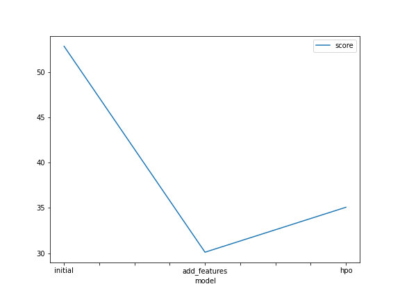
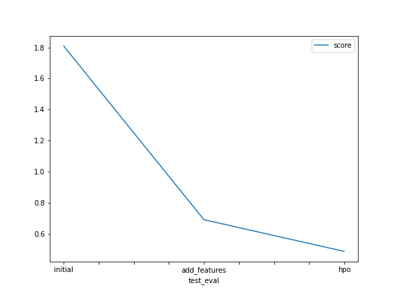

# Report: Predict Bike Sharing Demand with AutoGluon Solution
### Chiranjeev Singh

## Initial Training
### What did you realize when you tried to submit your predictions? What changes were needed to the output of the predictor to submit your results?
Initially, when I used the unprocessed dataset without conducting any data analysis or feature engineering, the model's performance fell short of expectations due to a significant amount of errors. Also to meet the submission requirements for Kaggle, I had to substitute the negative numbers with zeros. To implement this, first I described the `predictions` series to see if there are any negative values, second I counted how many negative values are present, and lastly I set them all to zero.

### What was the top ranked model that performed?
The WeightedEnsemble_L3 model performed the best out of all the models. The newly added features were simply the extracted values of year, month, day, and hour obtained by splitting the original datetime column.

## Exploratory data analysis and feature creation
### What did the exploratory analysis find and how did you add additional features?
For the exploratory data analysis, I performed a correlation check using sns.heatmap and found that 2 columns (registered and casual) have high correaltion with other features, so I removed them. The newly added features were simply the extracted values of year, month, day, and hour obtained by splitting the original datetime column. Also transforming the season and weather to categorical variables was done as our model had to work with numbers and we need an inverse mapping for the words present in any column with a number.

### How much better did your model preform after adding additional features and why do you think that is?
The model's performance increased drastically after adding additional features. This is because it's predicting power increased a lot after segregating a packed column with a lot of features into different columns each having a weighted say in the predictive power of the model. It also helped the model analyse the patterns which were difficult for it to learn earlier when all this data was clumped into a single column.

## Hyper parameter tuning
### How much better did your model preform after trying different hyper parameters?
Hyperparameter tuning proved to be beneficial and significantly enhanced the performance of the model. After tuning the Hyperparameters for LightGBM and CATBoost, although some configurations showed promising results, there were also instances where certain parameter settings had a detrimental impact on the model's performance, but all in all, tuning the Hyperparameters improved the overall model complexity.

### If you were given more time with this dataset, where do you think you would spend more time?
Definitely on the Hyperparameter tuning part. This is very essential in boosting a model's accuracy and with the correct tuning, high accuracy levels can be achieved.

### Create a table with the models you ran, the hyperparameters modified, and the kaggle score.
(Here hpo1,hpo2,hpo3 ... hpo6 are showcased as num_boost_round, num_leaves ... learning_rate.)

|model|num_boost_round|num_leaves|min_child_samples|iterations|random_strength|learning_rate|score
|--|--|--|--|--|
|initial|default_vals|default_vals|default_vals|default_vals|default_vals|default_vals|1.80840
|add_features|default_vals|default_vals|default_vals|default_vals|default_vals|default_vals|0.69184
|hyperparameter_tuned_model|GBM : 100|GBM: lower=20, upper=70, default=40|GBM: lower=0.01, upper=10, default=1|CAT: 100|CAT: lower=0.1, upper=1, default=0.5|CAT: lower=0.01, upper=0.1, default=0.05|0.48814

### Create a line plot showing the top model score for the three (or more) training runs during the project.

TODO: Replace the image below with your own.

### Create a line plot showing the top kaggle score for the three (or more) prediction submissions during the project.

TODO: Replace the image below with your own.

## Summary
In this project, I utilized the AutoGluon framework to train a model on the Bike Sharing Demand dataset obtained from Kaggle. I obtained the Bike Sharing Demand dataset from Kaggle, which contains information about bike rental demand over time. Then, I performed correaltion analysis tasks such as drawing heatmaps and removing heavily correlated features. Following this, I enriched the dataset by extracting additional features from the existing datetime column. Specifically, I split the datetime column into year, month, day, and hour components, which provided more granular temporal information. I utilized the AutoGluon library to train a model on the processed dataset. AutoGluon automates the process of model selection, hyperparameter tuning, and feature engineering. Then, I configured the hyperparameters for each model type used by AutoGluon. This included specifying the hyperparameter search space and setting constraints on values such as the number of boosting rounds, number of leaves, dropout probability, learning rate, and others.After training the models, I evaluated their performance using appropriate evaluation metrics(RMSE). After this, I compared the performance of different models trained by AutoGluon, including Gradient Boosting Machines (GBM), Neural Networks (NN), and CatBoost (CAT). This allowed me to identify the best-performing model for the given task.

Overall, this project involved training a model on the Bike Sharing Demand dataset using AutoGluon. Additional features were engineered from the datetime column, and hyperparameters were configured to optimize the model's performance. The goal was to accurately predict bike rental demand based on various factors. By applying the concepts covered in this unit of the course, I successfully developed a machine learning regression model using the AutoGluon framework in this project. Leveraging the skills acquired, I was able to preprocess the data, engineer additional features, configure hyperparameters, and train the model. The results were highly satisfactory as evidenced by the Kaggle score, which closely aligned with those achieved by professional developers with extensive experience. This project allowed me to showcase the practical application of the learned concepts and validate my proficiency in machine learning regression tasks.
